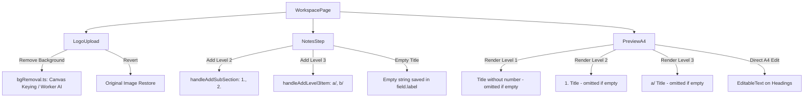

# Design Specification: Logo Background Removal, Empty Titles & 3-Level Hierarchy

**Date**: 2026-09-14  
**Author**: Antigravity & User  
**Status**: Approved (Brainstormed)

---

## 1. Overview & Goals

This specification defines three interconnected enhancements to the rapport de stage application:
1. **Logo Background Removal**: Provide a clearly visible, robust background removal capability for the company logo (and activity photo) with a 1-click action bar, instant canvas-based white/solid background keying, AI segmentation fallback, and a one-click "Rétablir l'original" revert button.
2. **Empty Titles Support ("vide")**: Allow section titles, subtitles, and sub-subtitles to be left blank. When empty, the A4 document renderer completely omits the heading line and numbering without leaving orphan numbers, blank gaps, or empty entries in the Sommaire.
3. **3-Level Title Hierarchy**: Structure content across three explicit levels:
   - **Level 1 (Titre principal)**: **Without number** (e.g. `Déroulement du stage`).
   - **Level 2 (Sous-titre)**: **Numbered with 1, 2, 3...** (e.g. `1. Organisation du fournil`).
   - **Level 3 (Sous-sous-titre)**: **Alpha with a/, b/...** (e.g. `a/ Pétrissage et pointage`).

---

## 2. Detailed Requirements

### 2.1 Logo Background Removal (`LogoUpload.tsx` & `bgRemoval.ts`)

#### Problem
Currently, the background removal button in `LogoUpload.tsx` is a tiny wand icon hidden inside the top-right corner with `opacity-0 group-hover:opacity-100`. On touch devices (Android Capacitor) or desktops without hovering over the exact coordinates, it is invisible and inaccessible. Furthermore, if the neural network download fails or is slow, the user is left with no alternative.

#### Solution
1. **Always-Visible Action Controls**:
   - Replace the hover-only overlay with a dedicated action toolbar below the image preview:
     - **`🪄 Retirer le fond`**: Primary action button with loading state.
     - **`↩ Rétablir l'original`**: Appears whenever background removal has modified the image, enabling instant revert.
     - **`🗑 Supprimer`**: Removes the image entirely.
2. **Dual-Engine Removal**:
   - **Instant Canvas Transparency (White / Solid background)**:
     - Detects background corners/edges and replaces white/near-white or solid backgrounds with transparency using an HTML5 `<canvas>` in < 20ms.
     - 100% offline, zero network requests, instant result.
   - **Neural Background Removal (`@imgly/background-removal`)**:
     - Available for non-white / complex backgrounds via the existing background worker.
3. **State Preservation**:
   - Store the original image `dataUrl` so the user can freely toggle between the original and the cutout version.

---

### 2.2 Empty Titles Support ("vide")

#### Problem
Users who want continuous paragraph flow or sections without an explicit title heading could not leave titles blank. The A4 renderer automatically prepended numbers (`1. `, `2. `) even when the title was blank, and form validation / modals rejected empty titles.

#### Solution
1. **A4 Document Rendering (`PreviewA4.tsx` & `reportDocument.ts`)**:
   - **Level 1 Title**: If `!part.titre || !part.titre.trim()`, skip rendering `<h2>` entirely.
   - **Level 2 Subtitle**: If `!subSection.titre || !subSection.titre.trim()`, skip rendering `<h3>` and its number (`1.`, `2.`).
   - **Level 3 Sub-subtitle**: If `!item.titre || !item.titre.trim()`, skip rendering `<h4>` and its letter (`a/`, `b/`).
   - In all cases, paragraphs render smoothly at the top of the block without blank header spacing.
2. **Table of Contents (Sommaire)**:
   - Omit entries whose titles are empty or whitespace-only.
3. **Editor Inputs**:
   - In `NotesStep.tsx`, `WorkspacePage.tsx`, and `PlanPickerModal.tsx`, allow clearing the title input without forcing default placeholder text back.
4. **Direct A4 Preview Editing**:
   - Enable inline editing via `EditableText` for headings in `PreviewA4.tsx` so users can edit or backspace/clear titles directly from the preview page.

---

### 2.3 3-Level Heading Hierarchy

#### Structure & Formatting Rules
1. **Level 1 — Titre principal**:
   - Format: Clean title **without numbers** (e.g. `Déroulement du stage`, `Présentation de l'entreprise`).
   - Style: Centered, primary theme color, font size `var(--doc-title-size)`.
2. **Level 2 — Sous-titre**:
   - Format: Numbered sequentially with Arabic numerals: `1. `, `2. `, `3. ` (e.g. `1. Organisation du fournil`).
   - Style: Left-aligned, bold/semi-bold, subtitle color, font size `var(--doc-subtitle-size)`.
3. **Level 3 — Sous-sous-titre**:
   - Format: Alpha-indexed with slash: `a/ `, `b/ `, `c/ ` (e.g. `a/ Pétrissage`, `b/ Cuisson`).
   - Style: Left-aligned, font size `var(--doc-body-size)` (or 13px), semi-bold text, followed by content paragraphs.

#### Data Model (`types.ts`)
The hierarchy will be modeled in a backward-compatible manner:
```typescript
export interface NoteField {
  id: string
  label: string
  hint?: string
  placeholder: string
  examples: string[]
  parentId?: string       // Present if this field is a Level 3 item under a Level 2 field
  prefix?: string         // "a/", "b/", etc.
}
```
- A `NoteField` with no `parentId` is a **Level 2** subtitle.
- A `NoteField` with `parentId === parentField.id` is a **Level 3** item.
- Note contents remain stored in `rapport.sections[stepId][fieldId]` and `rapport.sectionsGenerated[stepId][fieldId]`.
- Existing reports without `parentId` are seamlessly treated as Level 2 items.

#### Editor UX (`NotesStep.tsx` & `WorkspacePage.tsx`)
- In `NotesStep.tsx`:
  - Each Level 2 block displays its subtitle (with numbering `1.`, `2.`), its notes field, and an action button:
    - **`+ Ajouter un point (a/)`**
  - Clicking this adds a nested Level 3 item under that sub-section with automatic `a/`, `b/`... prefix.
  - Level 3 items can be re-labeled, deleted, or edited.
  - The AI generation button ("Rédiger") functions for each Level 3 field independently.

---

## 3. Component Architecture & Data Flow



---

## 4. Verification & Testing Plan

### 4.1 Automated & Build Checks
- Run `npm run build` (`tsc -b && vite build`) to ensure zero TypeScript compiler errors.
- Run `npm run lint` (`oxlint`) to verify lint cleanliness.

### 4.2 Manual Verification Steps
1. **Logo Background Removal**:
   - Upload a test logo (e.g. logo with white background).
   - Verify that the action buttons are immediately visible below the logo.
   - Click "Retirer le fond" -> Verify the background is removed cleanly.
   - Click "Rétablir l'original" -> Verify original image is restored without loss.
2. **Empty Titles**:
   - Clear a Level 1 title -> Verify that the A4 page omits the title and does not show orphan numbers or blank spaces.
   - Clear a Level 2 title -> Verify that `1.` disappears and only the paragraph text is displayed.
   - Clear a Level 3 title -> Verify that `a/` disappears and text flows smoothly.
3. **3-Level Hierarchy**:
   - Create a section with Level 1 title.
   - Add two Level 2 sub-sections -> Verify they render with `1. ` and `2. `.
   - Add two Level 3 items under sub-section 1 -> Verify they render with `a/ ` and `b/ `.
   - Test AI drafting on Level 3 fields.
   - Check Sommaire (Table of Contents) page numbers and layout.
